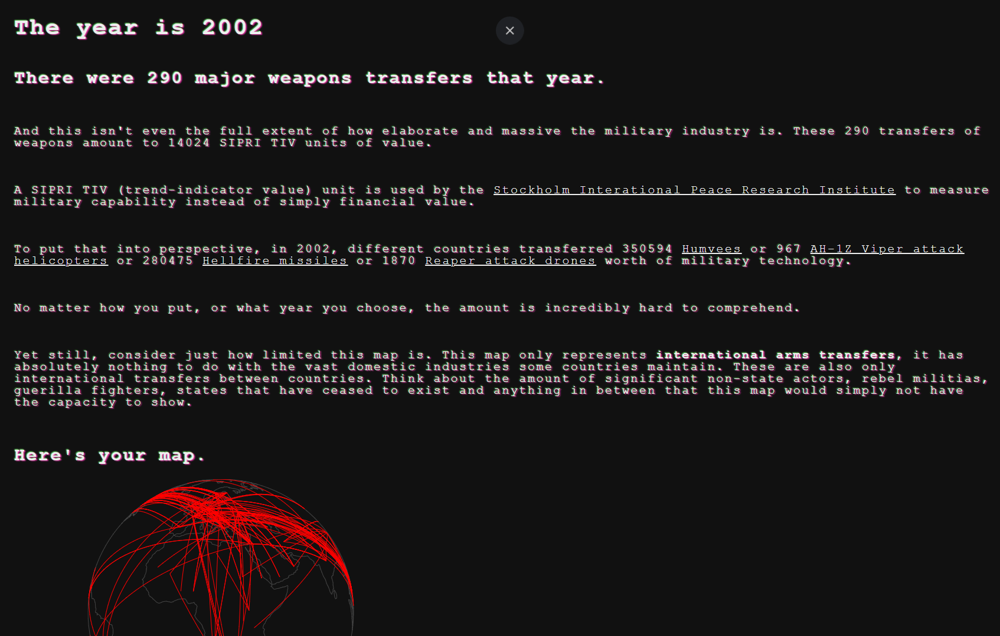
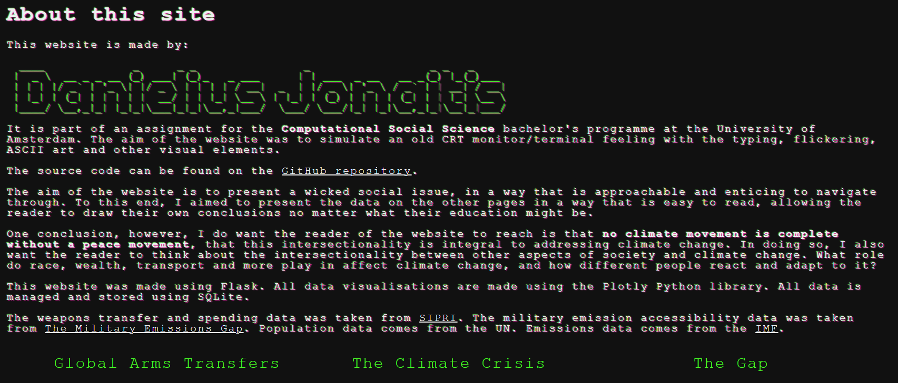
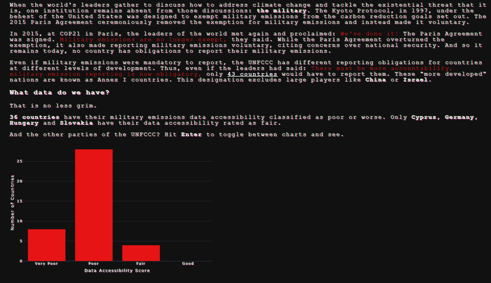

# Climate-Military Website
This website explores the intersection of climate change and the military industrial complex. It is built as part of an assignment for the University of Amsterdam's bachelor programme Computational Social Science.


*Part of weapons transfers page*
## Website
The page was built using Flask, all visusalisations were made using Plotly. 

If you wish to run the website yourself, navigate to the `webapp` directory and run the below command in your terminal:
```flask --app app run```

As part of the assignment, the website also tracks the amount of time users spend on a website and what they enter into forms. The code for that is found in the `user_tracking` folder.


*About page*
## Data
You can find all the data used, how it was cleaned and prepared for visualisations in the `backend` folder. Exploring the 3 Jupyter notebooks will give you an overview of the data and allow you to recreate it for yourself.

The database is managed using SQLite.

**The datasets used are:**
- Military spending and arms transfer data from: [SIPRI Arms Transfers Database](https://www.sipri.org/databases/armstransfers)
- Demographic (population) data from: [UN](https://unstats.un.org/unsd/demographic-social/)
- Military emission and accessibility data from: [The Military Emissions Gap](https://militaryemissions.org/)
- Greenhouse gas emission data from: [IMF](https://climatedata.imf.org/)

The original CSV files are included in the `data` folder.


*Part of gap page*
